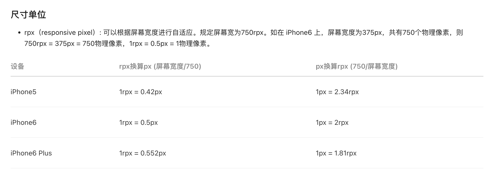

# unplugin-uni-app-tailwind

[](https://github.com/ModyQyW/uni-helper/blob/main/LICENSE)

[](https://www.npmjs.com/package/unplugin-uni-app-tailwind)

支持在 `uni-app` 中使用 `tailwindcss` 原有语法开发小程序。

## 使用

参考 [tailwindcss 文档](https://tailwindcss.com/) 在 `uni-app` 项目中安装配置 `tailwindcss`。你无需禁用 `preflight`，也无需调整原有语法（如 `.w-[200.5rpx]` 等），你只需要正常书写类名，该插件会替你处理剩下的事情。

安装依赖。

```shell
npm install unplugin-uni-app-tailwind
```

<details>
<summary>Vite</summary><br />

```typescript
// vite.config.ts
import { defineConfig } from 'vite';
import uni from '@dcloudio/vite-plugin-uni';
import tailwindcss from 'tailwindcss';
// @ts-ignore
import postcssPresetEnv from 'postcss-preset-env';
import uniAppTailwind from 'unplugin-uni-app-tailwind';

// https://vitejs.dev/config/
export default defineConfig({
  build: {
    lib: 'es6',
  },
  css: {
    postcss: {
      plugins: [
        tailwindcss(),
        postcssPresetEnv({
          stage: 3,
        }),
      ],
    },
  },
  plugins: [
    uni({
      vueOptions: {
        reactivityTransform: true,
      },
      viteLegacyOptions: {
        targets: ['ios >= 10', 'chrome >= 53'],
      },
    }),
    uniAppTailwind.vite({
      /* options */
    }),
  ],
});
```

<br /></details>

<details>
<summary>Vue CLI</summary><br />

```javascript
// vue.config.js
module.exports = {
  configureWebpack: {
    plugins: [
      require('unplugin-uni-app-tailwind').webpack({
        /* options */
      }),
    ],
  },
};
```

<br /></details>

## 原理

`uni-app` + `tailwindcss` 不能编译出小程序正常代码的错误原因有两个：

- 样式文件中含有不支持的字符，如 `[]`、`()`、`#`、`!`、`/`、`.`、`:`、`,`、`%`、`'` 等；
- 样式文件中含有不支持的元素，如 `html`, `body`、`img`、`span`、`a`、`*` 等。

那么，我们只需要做到以下两点就可以让 `tailwindcss` 跑在小程序中，而不需要调整 `tailwindcss` 的语法来增加开发时的心智负担：

- 使用 `postcss` 改写样式文件里面的 `selector`，包括字符和元素；
- 使用 `babel` 改写模板文件里面的 `class`，只包括字符，这是为了和样式文件里面的 `selector` 相匹配。

你可以展开查看这个项目导出的默认配置。

<details>
<summary>导出的默认配置</summary><br />

```typescript
// 默认 space between 元素映射
// https://tailwindcss.com/docs/space
export const SpaceBetweenElements = ['view', 'button', 'text', 'image'];

// 默认 divide width 元素映射
// https://tailwindcss.com/docs/divide-width
export const DivideWidthElements = ['view', 'button', 'text', 'image'];

// 默认 uni-app 中元素映射
export const ElementMap: [string, string[]][] = [
  ['html', ['html', 'page']],
  ['body', ['body', 'page']],
  ['img', ['img', 'image']],
  ['span', ['span', 'text']],
  ['a', ['a', 'functional-page-navigator', 'navigator']],
  [
    '*',
    [
      'html',
      'body',
      'page',
      'cover-image',
      'cover-view',
      'match-media',
      'movable-area',
      'movable-view',
      'scroll-view',
      'swiper',
      'swiper-item',
      'view',
      'icon',
      'progress',
      'rich-text',
      'text',
      'button',
      'checkbox',
      'checkbox-group',
      'editor',
      'form',
      'input',
      'label',
      'picker',
      'picker-view',
      'picker-view-column',
      'radio',
      'radio-group',
      'slider',
      'switch',
      'textarea',
      'functional-page-navigator',
      'navigator',
      'audio',
      'camera',
      'image',
      'live-player',
      'live-pusher',
      'video',
      'voip-room',
      'map',
      'canvas',
      'ad',
      'ad-custom',
      'official-account',
      'open-data',
      'web-view',
      'navigation-bar',
      'page-meta',
    ],
  ],
];

// 默认 uni-app 中特殊符号映射，用于替换特殊符号
export const CharacterMap: [string, string][] = [
  ['[', '-'],
  [']', '-'],
  ['(', '-'],
  [')', '-'],
  ['#', '-h-'], // hash
  ['!', '-i-'], // important
  ['/', '-s-'], // slash
  ['.', '-d-'], // dot
  [':', '_'], // colon
  [',\\s', '-c-'], // comma
  [',', '-c-'], // comma
  ['%', '-p-'], // percentage
  ["'", '-q-'], // quote
  ['\\\\2c\\s', '-c-'], // comma
  ['\\\\2c', '-c-'], // comma
];

export const defaultOptions = {
  spaceBetweenElements: SpaceBetweenElements,
  divideWidthElements: DivideWidthElements,
  elementMap: ElementMap,
  characterMap: CharacterMap,
};
```

<br /></details>

`SpaceBetweenElements` 用于在没有提供自定义配置时，替换 `space between` 相关类的元素。`DivideWidthElements` 用于在没有提供自定义配置时，替换 `divide width` 相关类的元素。它们默认都只包含了 `view`、`button`、`text`、`image` 四个常用元素，这应该能满足绝大部分的需求了。你也可以手动调整。

而 `ElementMap` 提供了元素映射，用于替换 `preflight` 内的元素。这样，你就不需要禁用 `preflight` 了。

`CharacterMap` 提供了特殊符号的映射，用于替换特殊符号。这样，你就可以使用 `tailwindcss` 原有的语法开发，而无需手动调整 `tailwindcss` 配置了。

## FAQ

### rpx 转换



简而言之，`rpx` 是一个跟屏幕宽度挂钩的响应式单位，不应该也不需要把所有用到 `px` 或者 `rem` 的地方换成 `rpx`。

什么时候必须要用 `rpx`？我个人的经验是 `aside` 的宽度需要随屏幕宽度变化、`main` 根据 `aside` 宽度变化时，才必须用到 `rpx` + `flexbox` 的组合，否则用 `flexbox` 就已经足够了。

所以，这个插件不支持 `rpx` 转换。你可以直接 [使用任意值](https://tailwindcss.com/docs/adding-custom-styles#using-arbitrary-values)，如 `.w-[750rpx]`、`.w-[200rpx]`，我相信可以满足绝大部分的需求。

如果你悲伤地发现这没法满足你的需求，可能这个插件不适合你，请看看以下几个项目是否满足你的需求。

- [mini-program-tailwind](https://github.com/dcasia/mini-program-tailwind)
- [unocss-preset-uni](https://github.com/zguolee/unocss-preset-uni)
- [unocss-preset-weapp](https://github.com/MellowCo/unocss-preset-weapp)

### windicss / unocss 支持

`windicss` / `unocss` 是富具创造性的项目，尽管它们都声称支持 `tailwindcss` 所有功能，但它们问世时间都较短，我相信 `tailwindcss` 是目前更为稳妥的选择。

如果 `unocss` 未来成为 `windicss@4` 的底层引擎或者直接替代了 `windicss`（请阅读 [重新构想原子化 CSS](https://antfu.me/posts/reimagine-atomic-css-zh)），我非常乐意再写一个 `unplugin-uni-app-unocss` 插件（如果有必要的话）。

## 资源

- [改动日志](https://github.com/ModyQyW/uni-helper/tree/main/packages/unplugin-uni-app-tailwind/CHANGELOG.md)

## 关联项目

- [@modyqyw/tailwind-presets](https://www.npmjs.com/package/@modyqyw/tailwind-presets)

## 致谢

该项目从以下项目汲取了灵感并参考了代码。在此对它们的开发者表示由衷的感谢。

- [mini-program-tailwind](https://github.com/dcasia/mini-program-tailwind)
- [unocss-preset-uni](https://github.com/zguolee/unocss-preset-uni)
- [unocss-preset-weapp](https://github.com/MellowCo/unocss-preset-weapp)

也感谢以下项目的开发者，如果没有他们，前端开发比现在更加困难。

- [tailwindcss](https://tailwindcss.com/)
- [windicss](https://windicss.org/)
- [unocss](https://github.com/unocss/unocss)
